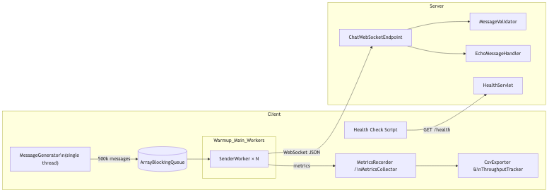
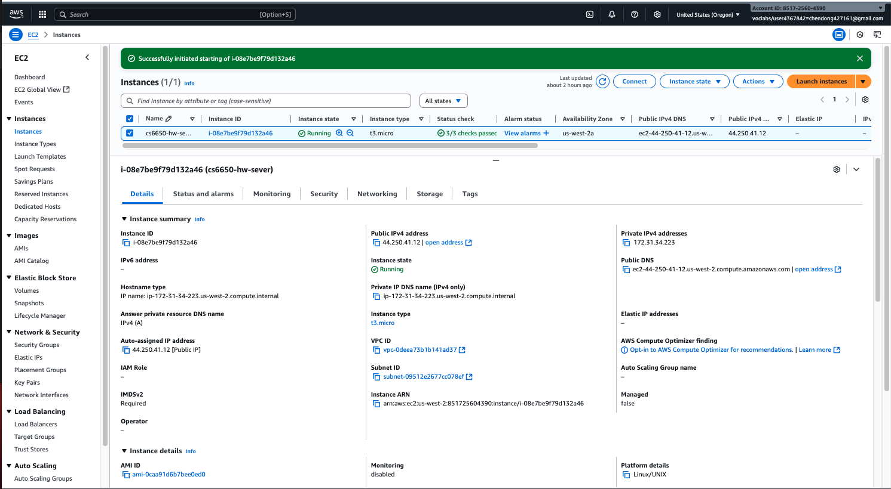

# CS6650 Assignment 1 – Design Document

> Git repository: https://github.com/VivianDongChen/cs6650_assignment.git  
> Modules: `/server`, `/client-part1`, `/client-part2`, `/results`

---

## 1. Architecture Overview

The client simulates load in two phases (warmup + main) using a shared message queue. Each sender maintains its own WebSocket connection to the Tomcat-hosted server. Metrics are captured locally and exported for analysis (Part 2/Part 3).

**EC2 Deployment Evidence:**

---

## 2. Major Classes and Relationships

### Server Module (`/server`)

| Class | Responsibility | Key Collaborators |
|-------|----------------|-------------------|
| `ChatWebSocketEndpoint` | Entry point for `/chat/{roomId}` WebSocket sessions. Parses payloads, delegates validation, and echoes results. | `MessageValidator`, `EchoMessageHandler` |
| `MessageValidator` | Validates userId, username, message, timestamp, messageType against assignment rules. | `ChatMessage` |
| `EchoMessageHandler` | Builds success/error JSON responses with server timestamps. | `ChatMessage` |
| `ChatMessage` | Jackson-mapped POJO for inbound payloads. | Used by endpoint + validator |
| `HealthServlet` | `/health` REST endpoint returning `{status,timestamp}` JSON for monitoring. | `ObjectMapperProvider` |
| `ObjectMapperProvider` | Centralizes Jackson configuration (JavaTimeModule). | All JSON consumers |

### Client Part 1 (`/client-part1`)

| Class | Responsibility | Key Collaborators |
|-------|----------------|-------------------|
| `App` | Bootstraps client, loads config, wires generator + orchestrator. | `ClientConfig`, `MessageGenerator`, `SenderOrchestrator` |
| `ClientConfig` / `ClientConfigLoader` | Immutable configuration + CLI parsing with defaults (500k messages, warmup 32×1000, etc.). | All client components |
| `MessageGenerator` | Single thread generating 500k messages with required distributions into a bounded queue. | `ChatMessage`, queue |
| `SenderOrchestrator` | Manages warmup/main phases, submits `SenderWorker` tasks to executor, records timing. | `SenderWorker`, `MetricsRecorder` |
| `SenderWorker` | Maintains a persistent WebSocket connection, sends messages with retries (max 5) and exponential backoff. | `ReliableWebSocketClient`, `MetricsRecorder` |
| `ReliableWebSocketClient` | Thin wrapper over `java.net.http.WebSocket` providing connect/reconnect/send-and-wait semantics. | `SenderWorker` |
| `MetricsRecorder` | Thread-safe counters for successes, failures, retries, connections, runtime, throughput. | `SenderOrchestrator`, `SenderWorker` |

### Client Part 2 (`/client-part2`)

Extends Part 1 with additional metrics & exports:

| Class | Responsibility | Notes |
|-------|----------------|-------|
| `MessageMetric`, `MetricsCollector` | Per-message latency capture and thread-safe aggregation. | Stores 500k records in memory |
| `StatisticsAnalyzer`, `Statistics` | Compute mean/median/p95/p99/min/max, message type & room distribution. | Used after run completion |
| `ThroughputTracker` | Buckets acknowledgements into 10s windows for throughput CSV/chart. | |
| `CsvExporter` | Writes metrics and throughput CSV outputs to `results/part2-output`. | |
| `MetricsRecorder` (extended) | Includes per-phase timing hooks and integrates with collectors. | |

All Part 2 classes reuse Part 1 networking/threading components to keep behavior consistent.

---

## 3. Threading Model

### Message Generation
- **Single producer thread** (`MessageGenerator`) pre-generates up to 500,000 messages.
- Uses `ArrayBlockingQueue` (capacity 10,000) to buffer messages; workers block if queue drains.
- Messages follow spec distributions: `userId` 1–100,000, `username = user<id>`, 50 message templates, `roomId` 1–20, messageType mix 90% TEXT / 5% JOIN / 5% LEAVE, `timestamp = Instant.now()`.

### Warmup Phase
- Exactly 32 threads, each sending 1,000 messages (32,000 warmup messages).
- Workers establish new WebSocket connections; metrics captured separately.

### Main Phase
- Configurable thread count (typically 128 locally, 224–320 in EC2 tests).
- `SenderOrchestrator` divides remaining messages evenly across workers.
- Executors use cached thread pool; each worker runs to completion (no reuse).

### Metrics Threads (Part 2)
- Metrics collection is non-blocking: workers record metrics and return to sending.
- Post-run aggregation (single thread) generates statistics and CSV outputs.

---

## 4. WebSocket Connection Management

1. **Connection Lifecycle**  
   - Each `SenderWorker` owns a `ReliableWebSocketClient`.  
   - On start, `connect()` is invoked (timeout configurable, default `PT5S`).  
   - After sending all assigned messages, the worker closes the connection gracefully.

2. **Retry Semantics**  
   - For each message: up to 5 attempts (`max-retries=5`).  
   - Backoff starts at `initial-backoff` (default 50ms) and doubles until `max-backoff` (default 200ms Part 1, 1s Part 2).  
   - On retry, `metrics.addRetries(1)` is recorded.

3. **Reconnection Strategy**  
   - Any failure during send triggers `client.reconnect()` (closing + re-opening).  
   - Successful reconnection increments `metrics.incrementConnectionReconnected()`.  
   - Certain failures (e.g., invalid payload) mark message as failed after final attempt.

4. **Thread Safety**  
   - `ReliableWebSocketClient` synchronizes critical sections to avoid concurrent writes on a single WebSocket.
   - Message queue + metrics classes use `BlockingQueue` and `AtomicLong`/`ConcurrentLinkedQueue` to avoid contention.

5. **Server Handling**  
   - `ChatWebSocketEndpoint` validates messages and echoes them with server timestamps.  
   - Invalid payloads return `{status:"error",errors:[...]}`; valid payloads include `serverReceiveTime` and `serverSendTime`.  
   - Endpoint logs errors and performs best-effort close on IO exceptions.

---

## 5. Little’s Law Calculations & Observations

Little’s Law: `λ = L / W` (throughput equals concurrency divided by service time).

### Local Environment (Loopback)
- **Single-thread baseline**: 1,000 messages in **1,916 ms** → `W_local = 1.916 ms`.
- Predicted vs observed throughput:

| Threads (L) | Predicted λ = L / W_local (msg/s) | Observed λ (msg/s) | Efficiency |
|-------------|-----------------------------------|--------------------|------------|
| 48 | ≈ 25,052 | 16,061 | 64.1% |
| 64 | ≈ 33,403 | 20,435 | 61.2% |
| 96 | ≈ 50,104 | 27,382 | 54.7% |
| **128** | **≈ 66,805** | **30,255** | **45.3%** |
| 160 | ≈ 83,507 | 28,249 | 33.8% |

**Takeaway:** Optimal throughput occurs at 128 threads (≈30k msg/s). Efficiency drops as contention and retries grow, revealing diminishing returns beyond 128 threads.

### EC2 Environment (Public Internet)
- **Single-thread baseline**: 1,000 messages in **17,371 ms** → `W_ec2 = 17.371 ms` (≈15.455 ms slower than local).
- Predicted vs observed throughput:

| Threads (L) | Predicted λ = L / W_ec2 (msg/s) | Observed λ (msg/s) | Efficiency |
|-------------|---------------------------------|--------------------|------------|
| 224 | ≈ 12,900 | 6,747 | 52.3% |
| 256 | ≈ 14,739 | 7,687 | 52.2% |
| **288** | **≈ 16,582** | **7,941** | **47.9%** |
| 320 | ≈ 18,424 | 5,325 | 28.9% |

**Takeaway:** Higher latency necessitates more concurrency (288 threads) to hide network delays. Efficiency remains ~50% until overload at 320 threads causes timeouts and failures.

### Part 2 Enhancements
- Detailed metrics (latency percentiles, throughput buckets) confirm Little’s Law insights:
  - Mean latency ≈ 21.4 ms, aligning with predicted 17.371 ms + retry overhead.
  - Peak throughput 10,972 msg/s in Part 2 indicates improved connection reuse and instrumentation overhead is negligible.

---

## 6. Deployment & Testing Notes

- **Server Deployment**: Tomcat 9 on AWS EC2 (us-west-2). Health verified via `/health` and WebSocket echo tests (`wscat`, Postman).  
- **Client Execution**: Maven builds shaded JARs for Part 1 & Part 2. CLI flags allow tuning thread counts, retries, and URIs.  
- **Results Artifacts**: Screenshots, CSV exports, charts, and this design document reside in `/results/` for quick reference.
- **EC2 Evidence**: The included AWS console screenshot (see above) documents the running instance (region us-west-2, public IP 44.250.41.12) used for performance testing.
