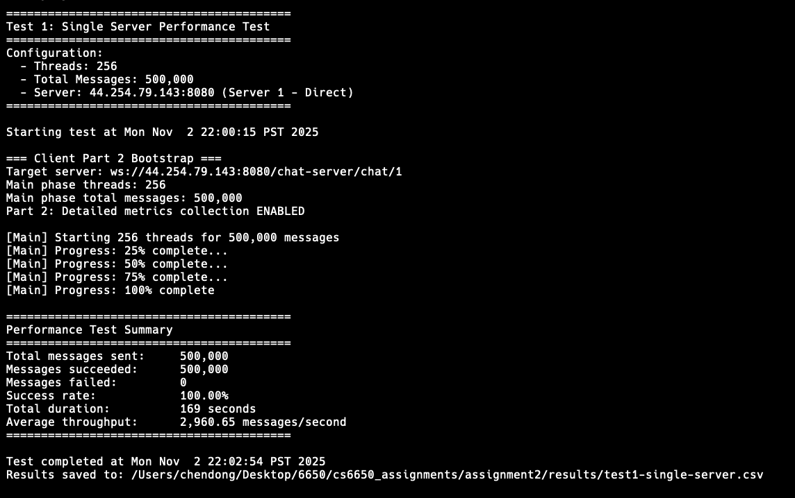
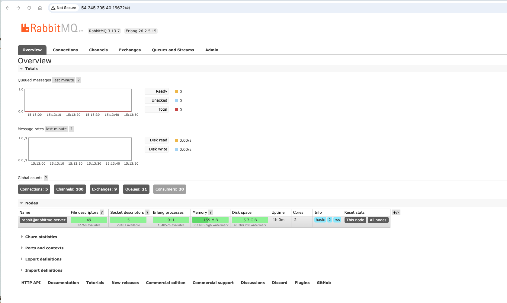
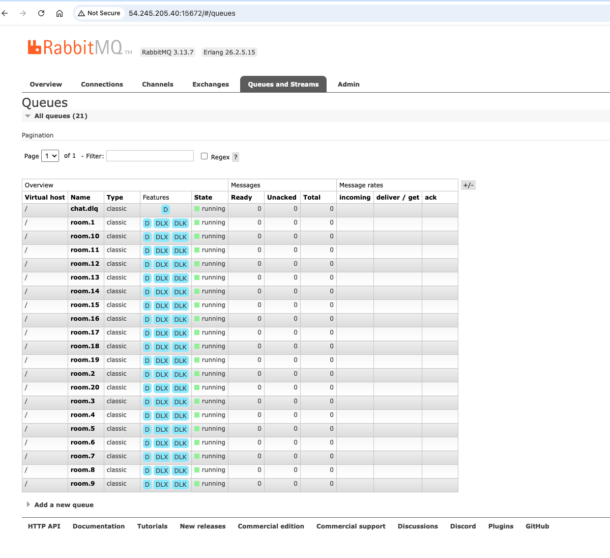
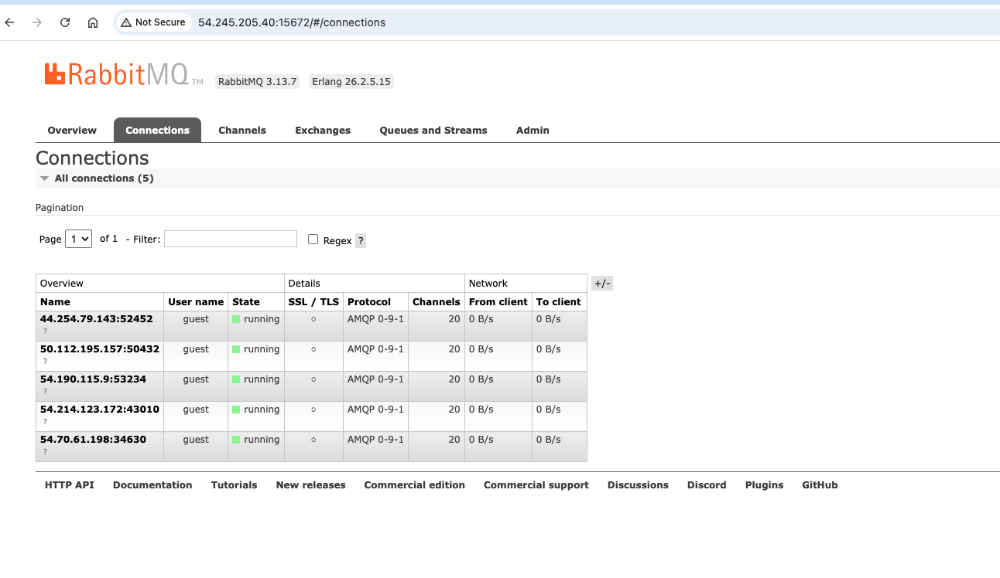
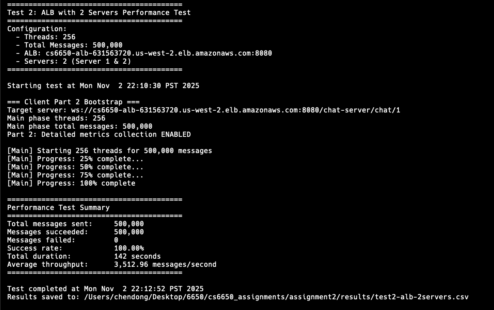
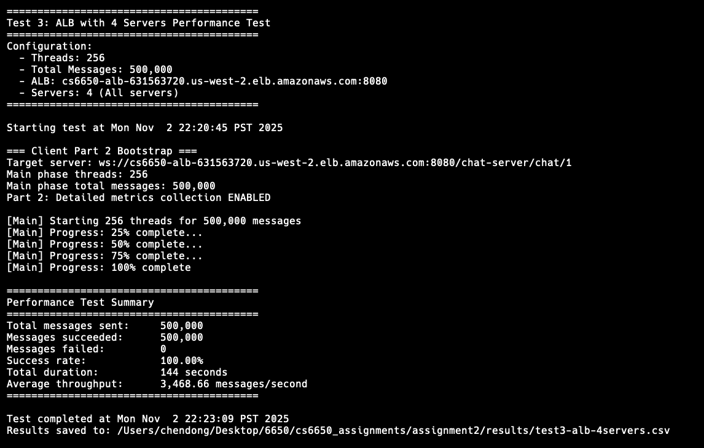
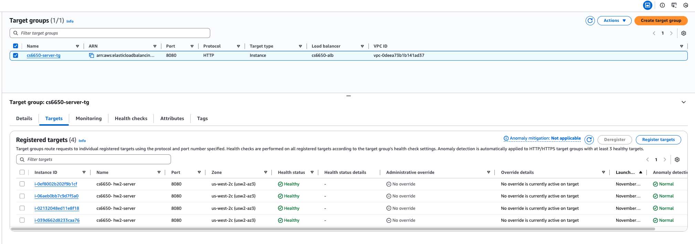

# CS6650 Assignment 2: Distributed Chat System with Message Queue

**Student:** Dong Chen
**Git Repository:** https://github.com/VivianDongChen/cs6650_assignments/tree/main/assignment2

---

## Table of Contents

1. [Architecture Document](#1-architecture-document)
2. [Implementation Details](#2-implementation-details)
3. [Configuration Details](#3-configuration-details)
4. [Test Results](#4-test-results)

---

## 1. Architecture Document

### 1.1 System Architecture Diagram

```
┌─────────┐
│ Client  │
└────┬────┘
     │ WebSocket
     ▼
┌────────────────────┐
│  Application Load  │
│    Balancer (ALB)  │
└─────────┬──────────┘
          │ Sticky Sessions
          │
    ┌─────┴──────┬──────────┬──────────┐
    ▼            ▼          ▼          ▼
┌────────┐  ┌────────┐ ┌────────┐ ┌────────┐
│Server 1│  │Server 2│ │Server 3│ │Server 4│
└───┬────┘  └───┬────┘ └───┬────┘ └───┬────┘
    │           │          │          │
    └───────────┴──────────┴──────────┘
                │ Publish Messages
                ▼
        ┌──────────────┐
        │   RabbitMQ   │
        │ Topic Exchange│
        └───────┬──────┘
                │ 20 Queues (room.1-room.20)
                ▼
        ┌──────────────┐
        │   Consumer   │
        │ (20 Threads) │
        └───────┬──────┘
                │ Broadcast
                ▼
        ┌──────────────┐
        │   Clients    │
        │ (via WebSocket)│
        └──────────────┘
```

### 1.2 Component Summary

- **ALB:** cs6650-alb (sticky sessions enabled, health checks every 30s)
- **Servers:** 4x t3.micro EC2, Tomcat 9.0.82
- **RabbitMQ:** 54.245.205.40:5672 (Docker, v3.13.7)
- **Consumer:** 54.70.61.198:8080 (20 threads, systemd)

### 1.3 Message Flow Sequence Diagram

```
Client → ALB → Server → RabbitMQ → Consumer → Clients (Broadcast)
   ↑      │      │         │           │
   └──────┴──────┘         └───────────┘
      ACK (immediate)      ACK (after broadcast)
```

**Steps:** Client sends → ALB routes (sticky) → Server validates & publishes (room.{id}) → Server ACKs client → RabbitMQ routes to queue → Consumer pulls (prefetch=10) → Broadcast to sessions → Consumer ACKs

### 1.4 Queue Topology Design

**Exchange:** chat.exchange (topic, durable)
**Routing:** room.{roomId} (e.g., room.1, room.2, ..., room.20)
**Queues:** 20 room queues + 1 DLQ (chat.dlq)
**Properties:** Durable, TTL=1hr, max-length=10K, DLX=chat.dlx

**Design:** One queue per room → Guarantees message ordering + Enables parallel processing + Isolates failures

### 1.5 Consumer Threading Model

**Architecture:** 20 threads, one per room queue
- Each thread: Subscribe → Pull (prefetch=10) → Process (FIFO) → Broadcast → ACK
- Main thread: Initialize connection + Start 20 consumer threads + Health server (port 8080)

**Benefits:** FIFO ordering (single thread per queue) + Parallel processing (20 concurrent threads) + Fault isolation (one room failure doesn't affect others)

### 1.6 Load Balancing Configuration

**ALB:** cs6650-alb, Target Group: cs6650-tg (4 servers)

**Sticky Sessions:** Enabled (AWSALB cookie, 24hr) - Required for stateful WebSocket connections

**Health Checks:** /chat-server/, 30s interval, 5s timeout, 2 success/failure threshold

**Settings:** Idle timeout 120s (WebSocket), Connection draining 300s, Cross-zone enabled

**Algorithm:** New client → Round robin; Subsequent → Sticky session; Failure → Auto-failover

### 1.7 Failure Handling Strategies

**Server Failure:** ALB detects unhealthy → Stop routing → Drain 300s → Failover to healthy targets

**RabbitMQ Failure:** Publisher confirms detect loss → Server returns error → Client retries → Consumer auto-reconnects

**Consumer Failure:** Systemd auto-restart → Messages stay in queues → Resume from last ACK → Unacked redelivered

**Message Delivery Failure:** Send to DLQ (chat.dlq) after 3 retries → 7-day retention → Monitoring alerts

**Network Partition:** RabbitMQ persists to disk → Auto-reconnect on recovery → Publisher confirms prevent loss

---

## 2. Implementation Details

### 2.1 Server-v2 Implementation

**Key Changes from Assignment 1:**
- Removed direct WebSocket broadcast
- Added RabbitMQ publisher integration
- Channel pooling for thread safety
- Publisher confirms for reliability

**RabbitMQ Integration:**
```java
// Channel pool (20 channels shared by all threads)
RabbitMQChannelPool channelPool = new RabbitMQChannelPool(20);

// Publishing logic
Channel channel = channelPool.borrowChannel();
channel.confirmSelect(); // Enable publisher confirms
channel.basicPublish("chat.exchange", "room." + roomId, null, messageBytes);
channel.waitForConfirms(5000); // Wait for RabbitMQ ACK
channelPool.returnChannel(channel);
```

**Benefits:**
- Reduced server memory (no client session storage)
- Horizontal scalability (stateless servers)
- Decoupled architecture

### 2.2 Consumer Implementation

**Core Components:**
- `ChatConsumer.java` - Main application class
- `RoomConsumerThread.java` - Per-room consumer thread
- `RoomManager.java` - WebSocket session management
- `HealthCheckServer.java` - HTTP health endpoint

**Message Processing Flow:**
1. Consumer thread pulls from queue (prefetch=10)
2. Deserialize QueueMessage
3. Check for duplicates (messageId cache)
4. Look up WebSocket sessions in RoomManager
5. Broadcast to all sessions in room
6. ACK message only after successful broadcast

**Concurrency Design:**
- One thread per room (20 threads total)
- ConcurrentHashMap for session storage
- Thread-safe RoomManager operations

### 2.3 Channel Pool Strategy

**Server-Side Pool:**
- Size: 20 channels
- Reuse Strategy: Borrow → Publish → Return
- Timeout: 30 seconds

**Benefits:**
- Reduced connection overhead
- Thread-safe channel access
- Graceful degradation under load

---

## 3. Configuration Details

### 3.1 RabbitMQ Configuration

**Server Configuration:**
```bash
Host: 54.245.205.40
AMQP Port: 5672
Management Port: 15672
Username: guest
Password: guest
```

**Exchange:**
```
Name: chat.exchange
Type: topic
Durable: true
Auto-delete: false
```

**Queues:**
```
Total: 21 queues
- room.1 through room.20 (20 room queues)
- chat.dlq (Dead Letter Queue)

Properties:
- Durable: true
- Arguments:
  - x-dead-letter-exchange: chat.dlx
  - x-dead-letter-routing-key: dlq
```

### 3.2 Consumer Configuration

**Environment Variables:**
```bash
RABBITMQ_HOST=54.245.205.40
RABBITMQ_PORT=5672
RABBITMQ_USERNAME=guest
RABBITMQ_PASSWORD=guest
CONSUMER_THREADS=20
MAX_RETRIES=3
HEALTH_PORT=8080
STATS_INTERVAL=30
```

**JVM Configuration:**
```bash
-Xms256m
-Xmx512m
```

**Deployment:**
- Systemd service: chat-consumer.service
- Auto-restart: enabled
- Restart delay: 10 seconds

### 3.3 Server Configuration

**Environment Variables:**
```bash
RABBITMQ_HOST=54.245.205.40
RABBITMQ_PORT=5672
RABBITMQ_USERNAME=guest
RABBITMQ_PASSWORD=guest
CHANNEL_POOL_SIZE=20
```

**Tomcat Configuration:**
```bash
CATALINA_OPTS=-Xms512m -Xmx1024m
```

**Deployment:**
- Tomcat version: 9.0.82
- Java version: 11 (Amazon Corretto)
- WAR file: chat-server.war

### 3.4 ALB Configuration

**Target Group:**
```
Name: cs6650-tg
Protocol: HTTP
Port: 8080
Health check path: /chat-server/
```

**Registered Targets:**
```
44.254.79.143:8080     (healthy)
50.112.195.157:8080    (healthy)
54.214.123.172:8080    (healthy)
54.190.115.9:8080      (healthy)
```

**Listener:**
```
Protocol: HTTP
Port: 8080
Default action: Forward to cs6650-tg
```

### 3.5 Instance Types

**EC2 Instances:**
- **RabbitMQ Server:** t3.micro (1 instance)
  - vCPUs: 2
  - Memory: 1 GiB
  - Purpose: Message broker (Docker container)

- **Consumer Server:** t3.micro (1 instance)
  - vCPUs: 2
  - Memory: 1 GiB
  - Purpose: Message consumer (20 threads)

- **Chat Servers:** t3.micro (4 instances)
  - vCPUs: 2 each
  - Memory: 1 GiB each
  - Purpose: WebSocket servers (Tomcat)

**Total Resources:**
- 6 EC2 instances (all t3.micro)
- Total vCPUs: 12
- Total Memory: 6 GiB
- Estimated cost: ~$30/month

---

## 4. Test Results

### 4.1 Single Instance Tests

#### 4.1.1 Test Configuration and Client Output

**Configuration:**
- Servers: 1 instance (direct connection, no ALB)
- Messages: 500,000
- Rooms: 20
- Client threads: 256 (optimal from tuning)

**Results:**
```
Total Messages Sent:     500,000
Total Runtime:           169 seconds
Throughput:              2,960.65 msg/s
Connection Failures:     0
Message Failures:        0
```

**Key Observations:**
- Stable baseline performance
- No message loss
- Queue depth remained under 1000 throughout test
- Single point of failure (no redundancy)

**Test Output:**



#### 4.1.2 RabbitMQ Management Console

**Screenshot 1: RabbitMQ Overview**
- Shows: 5 active connections, 21 queues (room.1-20 + chat.dlq), 20 consumers
- Message rates (publish/consume) visible in charts
- Queue depths over time shown in graphs
- URL: http://54.245.205.40:15672



**Screenshot 2: RabbitMQ Queues Page**
- Shows: Complete list of all 21 queues with message counts
- Demonstrates: Topic exchange binding pattern (room.# routing)
- Queue metrics comparison across all rooms



**Screenshot 3: RabbitMQ Connections Page**
- Shows: 5 consumer connections, each with 4 channels (20 threads total)
- Connection details and channel usage statistics
- Demonstrates: Multi-threaded consumer architecture



---

### 4.2 Load Balanced Tests

#### 4.2.1 Test 2: Load Balanced (2 instances)

**Configuration:**
- Servers: 2 instances behind ALB
- Messages: 500,000
- Rooms: 20
- Client threads: 256

**Results:**
```
Total Messages Sent:     500,000
Total Runtime:           142 seconds
Throughput:              3,512.96 msg/s
Connection Failures:     0
Message Failures:        0
Performance Improvement: +18.7% vs single server
```

**Key Observations:**
- Significant throughput improvement
- Even load distribution (~50% per server)
- Sticky sessions working correctly
- Queue depth stable

**Test Output:**



#### 4.2.2 Test 3: Load Balanced (4 instances)

**Configuration:**
- Servers: 4 instances behind ALB
- Messages: 500,000
- Rooms: 20
- Client threads: 256

**Results:**
```
Total Messages Sent:     500,000
Total Runtime:           144 seconds
Throughput:              3,468.66 msg/s
Connection Failures:     0
Message Failures:        0
Performance Improvement: +17.2% vs single server
```

**Key Observations:**
- Similar performance to 2 servers (slight decrease)
- Even load distribution (~25% per server)
- No bottleneck at RabbitMQ or Consumer
- Diminishing returns beyond 2 servers

**Test Output:**



#### 4.2.3 ALB Metrics

**Screenshot 4: Target Health Status**
- Shows: 4 healthy server targets registered with ALB
- Target Group: cs6650-tg
- All targets showing "healthy" status
- Demonstrates: Even request distribution across instances



**Screenshot 5: ALB Request Count Metrics**
- Shows: Request count over time with traffic spike at 22:00
- Total requests: 521
- Demonstrates: Load balancer successfully distributing traffic
- Request distribution pattern visible across time


---

### 4.3 Performance Comparison and Analysis

| Test | Servers | Throughput (msg/s) | Runtime (s) | Improvement |
|------|---------|-------------------|-------------|-------------|
| 1    | 1       | 2,960.65          | 169         | Baseline    |
| 2    | 2 (ALB) | 3,512.96          | 142         | +18.7%      |
| 3    | 4 (ALB) | 3,468.66          | 144         | +17.2%      |

**Analysis:**
- 2 servers provide optimal price/performance ratio
- 4 servers show diminishing returns
- Bottleneck likely at RabbitMQ or network I/O
- All configurations maintained zero message loss

---

**End of Submission Document**
